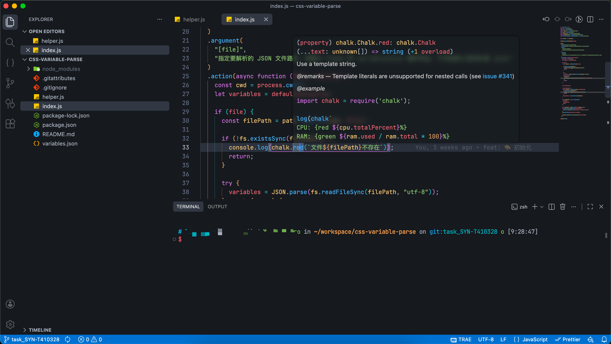

# 插件

- One Dark Pro - 用的是 One Dark Pro Night Flat
- Custom CSS and JS Loader - 加载`vscode-custom.css`

# vscode 设置
```
...
  "workbench.colorCustomizations": {
    "activityBar.activeBorder": "#00000000",
    "tab.activeBorder": "#00000000",
    "tab.border": "#00000000",
    "panelTitle.activeBorder": "#00000000",
    "statusBar.background": "#0071c9",
    "statusBar.focusBorder": "#00000000",
    "statusBar.foreground": "#ffffff",
    "terminal.tab.activeBorder": "#00000000",
    "terminal.border": "#00000000",
    "sideBar.border": "#00000000",
    "panel.border": "#00000000",
    "dropdown.border": "#00000000",
    "scrollbar.shadow": "#00000000",
    "focusBorder": "#00000000",
    "editorOverviewRuler.border": "#00000000",
    "editorHoverWidget.border": "#00000000",
    // 以下跟主题变更
    "tab.activeBackground": "#323842",
    "input.background": "#32384280",
    "dropdown.background": "#32384280",
    "editorHoverWidget.background": "#1e222780",
    "quickInput.background": "#1e222780"
  },
...
```
